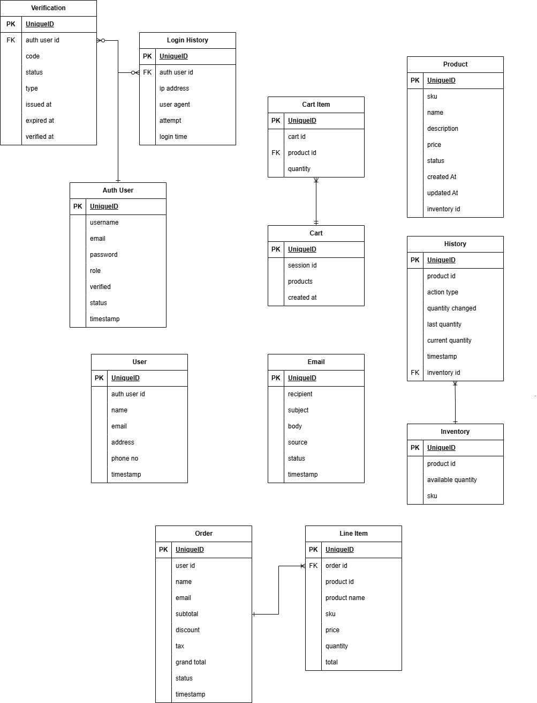

# Practical Microservice Workshop

This repository contains a practical implementation of microservices architecture.

## Microservices

- **Inventory Service** - Manages product inventory.
- **Product Service** - Manages product details.

## Architecture Diagram

The following diagrams illustrate the system's architecture:

- **Microservices Architecture**: 
- **Entity-Relationship Diagram**: Open `diagram/ER Diagram.drawio` with [draw.io](https://app.diagrams.net/) for modifications.

## Getting Started

To set up and run the services, follow the instructions in each service's respective `README.md`.

### Prerequisites

Ensure you have [Docker](https://www.docker.com/), [pnpm](https://pnpm.io/), and [Node.js](https://nodejs.org/) installed.

### Running the Services

Start the required dependencies using Docker:

```bash
docker-compose up -d
```

Then, navigate to the specific service directory and follow its setup instructions.

